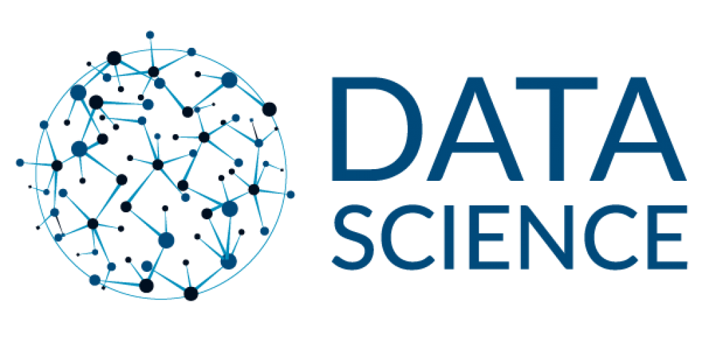

 

Este repositório é referente ao curso de Data Science que estou fazendo aqui você vai conhecer e aprender a aplicar todos os principais conceitos e técnicas para se qualificar e atuar como um Cientista de Dados, com detalhes para leigos, exemplos práticos de codificação em **R e Python** usando dados reais, explicações de resolução de fórmulas passo a passo, contendo: 

:white_check_mark: *Estatística I, II e III*

:white_check_mark: *Séries Temporais*

:white_check_mark: *Machine Learning*

:white_check_mark: *Artificial Neural Networks e Deep Learning*

:white_check_mark: *Visualização, Gráficos e Dashboards*

:white_check_mark: *Grafos e Redes Sociais*

:white_check_mark: *Mineração de Texto*

:hourglass_flowing_sand: *SQL e NoSQL*

:hourglass_flowing_sand: *Fundamentos de Gestão de Projetos*

:hourglass_flowing_sand: *Power BI*

:hourglass_flowing_sand: *Tableau*

:hourglass_flowing_sand: *Fundamentos de Big Data*

**O que vamos aprender** :books:

* Criar modelos preditivos com Deep Learning, Neural Networks e Series Temporais.

* Criar elementos gráficos com uso de boas práticas de visualização de dados.

* Aplicar conceitos básicos de mineiração de textos.

* Criar modelos de Regressão Linear e Logística.

* Potencializar sua compreensão sobre outras áreas de Machine. 

* Learning, como Agrupamentos, Associadores e Seleção de Atributos.

* Dominar os conceitos de Probabilidade, Intervalos de Confiança, Testes de Hipótese, Anova e Qui quadrado.

* Aplicar conceitos de Grafos.

* Ver cases reais das principais distribuições estatísticas: Normal, Poisson, Binomial, T de Student.

* Aprenda conceitos de Gestão de Projetos.

* Estude e pratique linguagem SQL.

* Conheça bancos de dados NoSQL com MongoDB.

* Conheça técnicas como Feature Scaling e Categorical Encoding.

 

